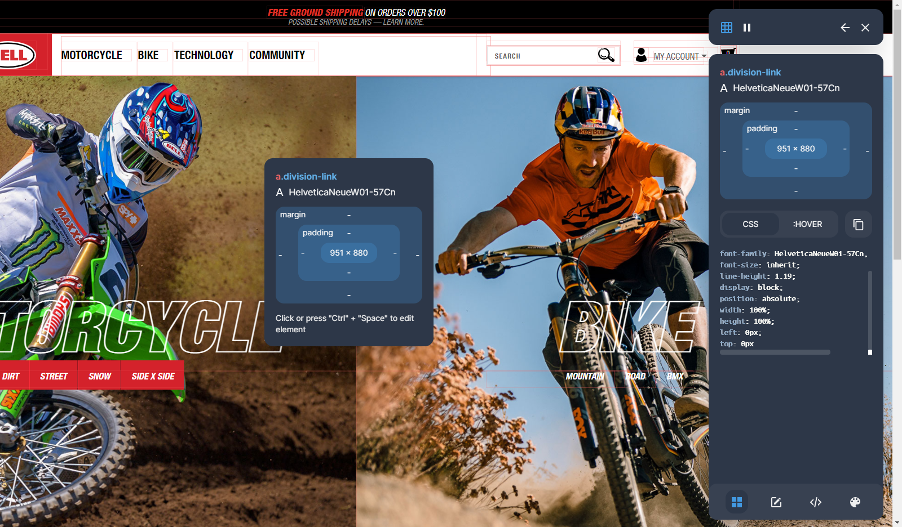

# Bell CSS Inspector

The easiest way to inspect and edit CSS

## Features

- 🔎 Get CSS Properties from any element by selecting it
- ✏️ Get and edit element attributes
- ⌨️ Add your custom CSS to the website
- 🎨 Get the color palette of the website

## Installation

## Manual Install

> Here is how to install this browser extension in your favorite browsers (only Chrome is currently supported):

Add to Google Chrome

1. Download [WebKit Extension](https://github.com/Bell-Apps/Bell-CSS-Inspector/releases/download/v0.2.0/bell-css-inspector.crx)
2. Click **Keep** when prompted to download the file
3. Go to the following URL in a new Google Chrome tab: `chrome://extensions/`
4. In the top right corner, Enable **Developer Mode**
5. Drag and Drop `bell-css-inspector.crx` file into Extension page

## Build

- `yarn install` to install all dependencies
- `yarn watch:dev` for development
- `yarn build` build for production
